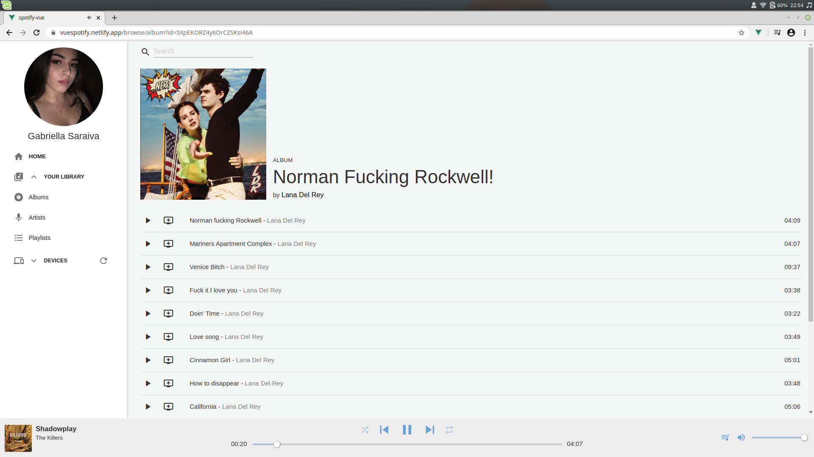
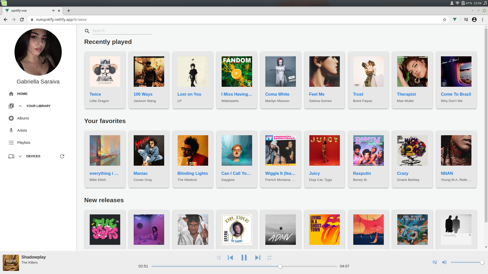
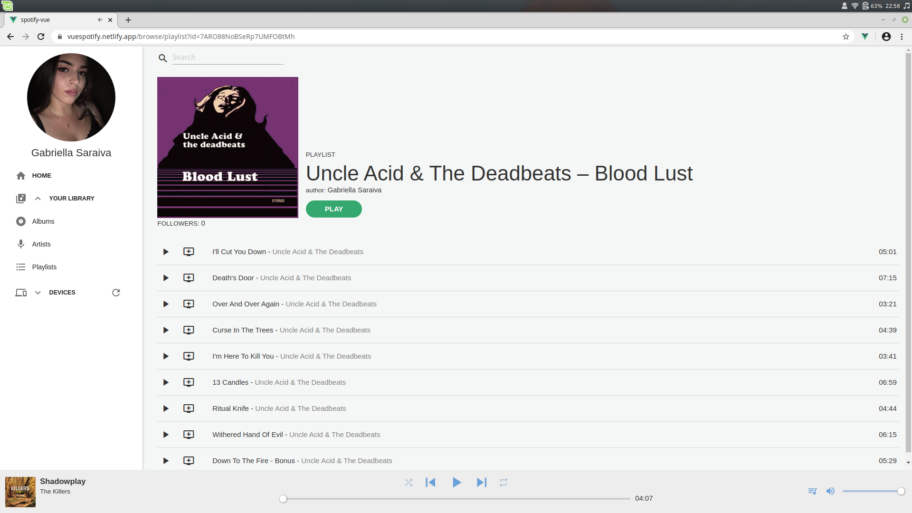

# spotify-vue
A spotify clone made with vue https://vuespotify.netlify.app/

[](https://app.netlify.com/sites/vuespotify/deploys)

## Installation

```
git clone https://github.com/youngkaneda/spotify-vue
cd spotify-vue
npm install
npm run serve
# now go to the localhost:port link deployed by npm
```

## Features

1. Listen music. *basic*
2. Use the player functionalities.
3. You can see in your library:
    * Your playlists.
    * Followed playlists.
    * Saved albums.
    * Followed artists.
4. Top user tracks, Recently played, recommendations and new releases.
5. Artists albums.
6. You can play a playlist, not albums yet.
7. Queue, add to queue, jump to song in queue.
8. A list of connected devices, you can connect to them.*
9. Search artists, albums, songs and playlists.

*\* To use the player functionalities you need to connect with the web sdk player created in this application, unfortunately the spotify doesnt give support to listen the state in other devices. I could use polling but performance would be a huge problem.*
## Limitations

1. You can't follow, create, edit or delete playlists.
2. You can't follow artits, save albums or songs either.
3. You can't edit your profile.
4. The queue present some weird behaviors (I still analyzing this).
5. **I don't know in which browsers the layout fits well, on chromium in a 1920x1080 screen everything is fine.**
6. *It isn't responsive.*
7. I didn't implemented pagination yet, the spotify web api works with pagging objects in some endpoints, i.e. if you wanna see your playlists, it will load the first 50 results, just it, i will implement the pagination listening to some scroll events or whatever.

## Motivation

I just wanted to create a webapp to practice my design and web dev skills in vue, also as using a 3rd party api.

## Screenshots





## TODO

1. Modularize everything, unfortunately it has a lot of boilerplaited and hard coded code. I pretend modularize the maximum I can to leave the code more clean to maintain. 
2. Study more about the vue lifecycle to better the experience of the user and the state of the app.
3. ~~Use a solution for mantain the state when the user refresh the page.~~
4. ~~Resolve problem in user navigation througth URL. (It will break if you try)~~
5. Resolve ALL the eslint warnings. *85 problems (25 errors, 60 warnings)*


Feel free to fork and contribute.

*PS.: Help me fixing the responsivity and layout stability in different browsers. Special thanks to [rodgeraraujo](https://github.com/rodgeraraujo) and [natansevero](https://github.com/natansevero) that helped me a lot with a lot of doubts during the whole project.*
